<h1 align="center">
  
  欢迎使用 Itoc Crazy Error 编辑器
</h1>

  
  
本文档于2026年10月10日更新为针对Itoc v2设计的新文档

---

<h2 style="font-size: 32px; font-weight: bold; display: flex; align-items: center; gap: 20px; margin-bottom: 16px;">
   
  关于 Itoc
</h2>

**Itoc**是小小电子xxdz开发的一个、也是**世界首个 Windows crazy error程序开发工具**，可以方便、无门槛的开发各种音乐的crazy error程序，释放您的创造力！同时，Itoc 也能用于制作窗口 MV、自动化程序等，让创意拥有更多可能

无论您是刚接触编程的新手，还是想要快速制作有趣程序的老手，Itoc编辑器都能为您提供简单而强大的工具集，让您专注于创意本身嗷

  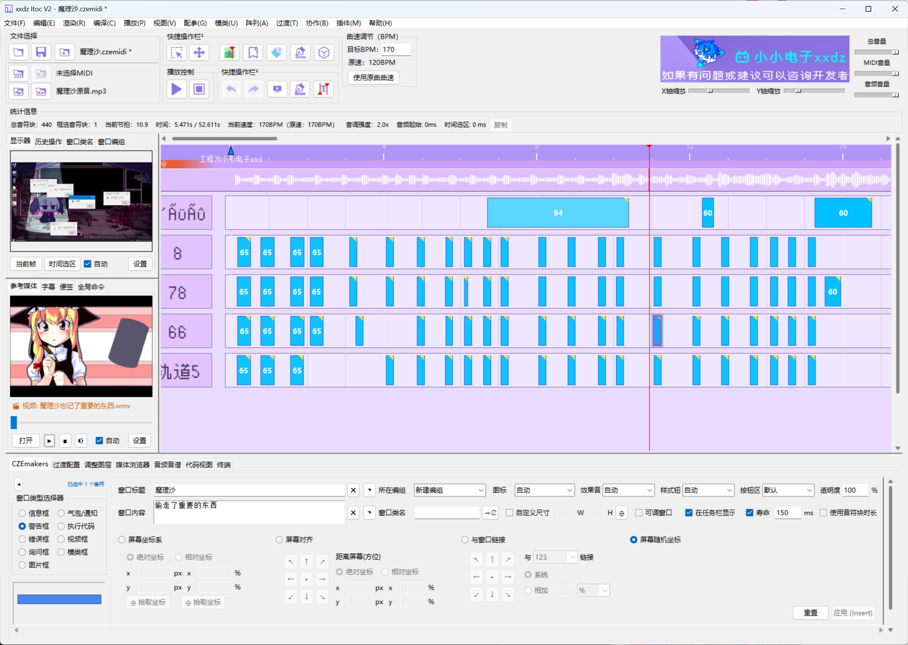

---

<h2 style="font-size: 32px; font-weight: bold; display: flex; align-items: center; gap: 20px; margin-bottom: 16px;">
   
  什么是 Crazy Error？
</h2>

**Crazy error** 就是弹窗类鬼畜，算是鬼畜区与软件极客区的结合体，特点为将一段音乐，配上Windows效果音MAD，视觉上进行有观赏性、卡点的系统弹窗，有极大的自由性

想象一下：将您喜欢的音乐与Windows系统独特的视觉效果结合，创造出既有趣又富有节奏感的交互体验。这就是crazy error的魅力所在！

### Crazy Error 效果演示

*真 · 图片仅供参考*

> 上图展示了一个crazy error效果，通过Itoc编辑器可以轻松制作出这样的程序（呃..？）

---

<h2 style="font-size: 32px; font-weight: bold; display: flex; align-items: center; gap: 20px; margin-bottom: 16px;">
   
  开发目的
</h2>

目前网络上的crazy error基本都是使用视频（Pr、Ae、PPT等）+音频（Au、REAPER、FL等）结合制作的多媒体作品，虽然发挥空间很大，但是并非真实可在电脑运行的真程序 QwQ

如果直接编写真程序，那难度很大，需要掌握复杂的编程知识和Windows API调用。而本软件，就是来无痛无代码开发这种真程序的嘿嘿！

---

<h2 style="font-size: 32px; font-weight: bold; display: flex; align-items: center; gap: 20px; margin-bottom: 16px;">
   
  软件特点
</h2>

Itoc编辑器专注于提供最简单直观的crazy error程序开发体验：

<h3 style="font-size: 26px; font-weight: bold; display: flex; align-items: center; gap: 16px; margin-top: 24px; margin-bottom: 12px;">
   
  核心编辑能力
</h3>

- <a href="help/quickstart.html" style="text-decoration: none; color: #AB92F5; font-weight: bold; font-size: 17px;"> 直接导入音乐</a>：支持 MIDI 谱子文件，导入即可开始创作
- <a href="help/paint.html" style="text-decoration: none; color: #AB92F5; font-weight: bold; font-size: 17px;">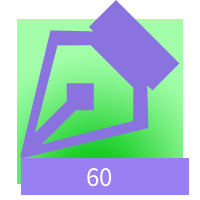 绘制音符块</a>：可视化界面设计，无需编写代码
- <a href="help/global_1.html" style="text-decoration: none; color: #AB92F5; font-weight: bold; font-size: 17px;"> 控制第三方窗口</a>：支持关闭、置顶、移动、模拟按键等操作
- <a href="help/global_1.html" style="text-decoration: none; color: #AB92F5; font-weight: bold; font-size: 17px;"> 全局命令</a>：在时间轴任意时刻触发特定动作，拥有极大发挥空间
- <a href="help/global_2.html" style="text-decoration: none; color: #AB92F5; font-weight: bold; font-size: 17px;"> 运行 cmd 命令</a> / <a href="help/global_2.html" style="text-decoration: none; color: #AB92F5; font-weight: bold; font-size: 17px;"> 编写 Python 代码</a>：执行系统命令或自定义 Python 脚本

<h3 style="font-size: 26px; font-weight: bold; display: flex; align-items: center; gap: 16px; margin-top: 24px; margin-bottom: 12px;">
   
  弹窗与视觉效果
</h3>

- <a href="help/czemaker.html" style="text-decoration: none; color: #AB92F5; font-weight: bold; font-size: 17px;"> CZEmaker 弹窗编排</a>：支持 9 种窗口类型，含图片框、视频框、气泡通知、执行代码、模类框等
- <a href="help/czemaker_advanced.html" style="text-decoration: none; color: #AB92F5; font-weight: bold; font-size: 17px;"> CZEmaker 进阶</a>：图片镂空、GIF 动画、mpv 视频、模类框的完整配置
- <a href="help/uiclass_1.html" style="text-decoration: none; color: #AB92F5; font-weight: bold; font-size: 17px;"> 模类系统 (UI Class)</a>：用模类设计器搭建自定义窗口，10 种控件、Base64 图片嵌入、跨工程复用
- <a href="help/transition.html" style="text-decoration: none; color: #AB92F5; font-weight: bold; font-size: 17px;"> 过渡动画</a>：入场/出场动画，支持淡入淡出、滑动、弹跳、弹性、展开/收缩、闪烁六大类
- <a href="help/adjust_layer.html" style="text-decoration: none; color: #AB92F5; font-weight: bold; font-size: 17px;">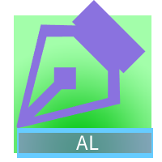 调整图层</a>：绘制特效区间，支持故障、像素化、扫描线、噪点、复古等滤镜
- <a href="help/cze_window_class.html" style="text-decoration: none; color: #AB92F5; font-weight: bold; font-size: 17px;"> 窗口类名</a> / <a href="help/cze_window_group.html" style="text-decoration: none; color: #AB92F5; font-weight: bold; font-size: 17px;">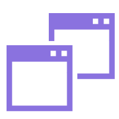 窗口编组</a>：设置类名和编组，支持窗口链接、批量关闭、阵列变换、镜像克隆

<h3 style="font-size: 26px; font-weight: bold; display: flex; align-items: center; gap: 16px; margin-top: 24px; margin-bottom: 12px;">
   
  音频与时间轴
</h3>

- <a href="help/timeline.html" style="text-decoration: none; color: #AB92F5; font-weight: bold; font-size: 17px;">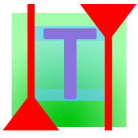 时间轴与事件块编辑</a>：选中、移动、拉伸、复制、粘贴、禁用等基础操作
- <a href="help/midi_color.html" style="text-decoration: none; color: #AB92F5; font-weight: bold; font-size: 17px;"> 音符块自身属性</a>：音高、颜色、自定义文本、音效、禁用状态、过渡标记
- <a href="help/insert_lyrics.html" style="text-decoration: none; color: #AB92F5; font-weight: bold; font-size: 17px;"> 插入歌词</a>：自动把歌词按切分规则分配到音符块上，支持 jieba 分词和 lrc 导入
- <a href="help/assign_window_sound.html" style="text-decoration: none; color: #AB92F5; font-weight: bold; font-size: 17px;"> 根据窗口类型赋予自定义音效</a>：按窗口类型批量给音符挂音效
- <a href="help/beat_event_point.html" style="text-decoration: none; color: #AB92F5; font-weight: bold; font-size: 17px;">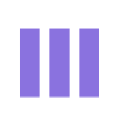 新建节奏事件点</a> / <a href="help/concurrent_event_point.html" style="text-decoration: none; color: #AB92F5; font-weight: bold; font-size: 17px;">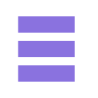 新建并发事件点</a>：按规律批量生成事件块
- <a href="help/marker_and_sticky_note.html" style="text-decoration: none; color: #AB92F5; font-weight: bold; font-size: 17px;"> 标记与轨道便利贴</a>：在时间轴上做点状备注和大段笔记
- <a href="help/yinpin_yinpu.html" style="text-decoration: none; color: #AB92F5; font-weight: bold; font-size: 17px;"> 音频音谱</a>：底部选项卡的 LED 电平表，实时显示音频电平，支持峰值保持

<h3 style="font-size: 26px; font-weight: bold; display: flex; align-items: center; gap: 16px; margin-top: 24px; margin-bottom: 12px;">
   
  辅助工具
</h3>

- <a href="help/sidebar.html" style="text-decoration: none; color: #AB92F5; font-weight: bold; font-size: 17px;"> 侧边栏</a>：显示器、历史操作、窗口类名、窗口编组、参考媒体、字幕、便签、全局命令 8 大选项卡
- <a href="help/sidebar_display.html" style="text-decoration: none; color: #AB92F5; font-weight: bold; font-size: 17px;"> 显示器</a> / <a href="help/sidebar_reference_media.html" style="text-decoration: none; color: #AB92F5; font-weight: bold; font-size: 17px;">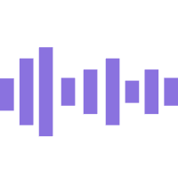 参考媒体</a>：实时渲染当前帧或时间选区，或打开外部素材作为参考
- <a href="help/str.html" style="text-decoration: none; color: #AB92F5; font-weight: bold; font-size: 17px;"> 字幕</a>：加载 SRT 字幕，边播放边显示，一键填入 CZEmakers
- <a href="help/media_browser.html" style="text-decoration: none; color: #AB92F5; font-weight: bold; font-size: 17px;"> 媒体浏览器</a>：管理工程目录下的所有素材，支持替换/脱机/重命名/查看引用表
- <a href="help/high_energy_table.html" style="text-decoration: none; color: #AB92F5; font-weight: bold; font-size: 17px;"> 高能进度表</a>：把工程事件按时间轴铺开，算出一条强度曲线，一眼看出哪段"活儿最多"
- <a href="help/terminal.html" style="text-decoration: none; color: #AB92F5; font-weight: bold; font-size: 17px;"> 终端</a>：内置命令行，用键盘快速操作工程，支持多行命令和历史记录
- <a href="help/code_view.html" style="text-decoration: none; color: #AB92F5; font-weight: bold; font-size: 17px;">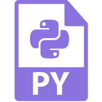 代码视图</a>：以 PyCharm 风格显示并编辑工程 JSON，支持查找替换和跳转行列
- <a href="help/GetWindowClassName.html" style="text-decoration: none; color: #AB92F5; font-weight: bold; font-size: 17px;"> 窗口拾取器</a>：抓取任意窗口的类名、句柄、标题，供全局命令使用

<h3 style="font-size: 26px; font-weight: bold; display: flex; align-items: center; gap: 16px; margin-top: 24px; margin-bottom: 12px;">
   
  协作与历史
</h3>

- <a href="help/cooperation.html" style="text-decoration: none; color: #AB92F5; font-weight: bold; font-size: 17px;"> 协作</a>：置入 CZEmidi 工程、对比媒体 MD5、对比工程差异、导出时间选区片段、AI 协作
- <a href="help/ctrl_z_undo_redo.html" style="text-decoration: none; color: #AB92F5; font-weight: bold; font-size: 17px;"> 撤销与重做</a>：基于磁盘快照栈，支持 30 步回滚，可跨程序重启保留历史

<h3 style="font-size: 26px; font-weight: bold; display: flex; align-items: center; gap: 16px; margin-top: 24px; margin-bottom: 12px;">
   
  输出与分发
</h3>

- <a href="help/render_cze_data.html" style="text-decoration: none; color: #AB92F5; font-weight: bold; font-size: 17px;"> 渲染为 CZE 数据文件</a>：把工程编译成解释器直接读取的数据文件
- <a href="help/render_python_code.html" style="text-decoration: none; color: #AB92F5; font-weight: bold; font-size: 17px;"> 渲染为 Python 代码</a>：把工程数据导出为 Python 脚本，方便嵌入其他项目
- <a href="help/export_audio.html" style="text-decoration: none; color: #AB92F5; font-weight: bold; font-size: 17px;"> 渲染为音频文件</a>：支持 WAV/FLAC/MP3/OGG 四种格式，多种音源可选
- <a href="help/render_video.html" style="text-decoration: none; color: #AB92F5; font-weight: bold; font-size: 17px;"> 渲染视频文件</a>：把工程演成完整视频，支持 MP4/AVI/MOV/MKV
- <a href="help/compile_exe.html" style="text-decoration: none; color: #AB92F5; font-weight: bold; font-size: 17px;"> 编译为 exe</a>：用 PyInstaller 打包成独立可执行文件，可自定义图标和版本信息
- <a href="help/assembly_package.html" style="text-decoration: none; color: #AB92F5; font-weight: bold; font-size: 17px;"> 组装打包模式</a>：复制拼装式打包，无需 Python 环境，速度极快
- <a href="help/test_run.html" style="text-decoration: none; color: #AB92F5; font-weight: bold; font-size: 17px;"> 测试运行</a>：按 F5 一键预览效果，不用编译就能看到工程跑起来的样子

<h3 style="font-size: 26px; font-weight: bold; display: flex; align-items: center; gap: 16px; margin-top: 24px; margin-bottom: 12px;">
   
  扩展与生态
</h3>

- <a href="help/plugin_user.html" style="text-decoration: none; color: #AB92F5; font-weight: bold; font-size: 17px;">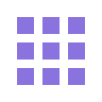 插件系统</a>：支持插件管理器，可导入/启用/禁用/卸载插件，插件可挂菜单、工具栏、快捷键、右键菜单、侧边栏
- <a href="help/plugin_dev.html" style="text-decoration: none; color: #AB92F5; font-weight: bold; font-size: 17px;"> 插件开发</a>：提供完整的 ModAPI，用 Python 即可开发自己的插件
- <a href="help/language_pack.html" style="text-decoration: none; color: #AB92F5; font-weight: bold; font-size: 17px;"> 语言包</a>：支持多语言切换，可导入/导出自定义语言包，已内置英文、日语、繁体中文、文言文
- <a href="help/settings.html" style="text-decoration: none; color: #AB92F5; font-weight: bold; font-size: 17px;"> 首选项</a>：12 个分类的设置面板，可调窗口、音频、波形、皮肤、缩放、音量、面板、解释器、自动保存、回滚、文件关联、语言
- <a href="help/settings_skin.html" style="text-decoration: none; color: #AB92F5; font-weight: bold; font-size: 17px;"> 皮肤设置</a>：自定义画布背景图片、透明度、时间轴背景色、ttk 主题、Windows 原生标题栏
- <a href="help/file_association.html" style="text-decoration: none; color: #AB92F5; font-weight: bold; font-size: 17px;">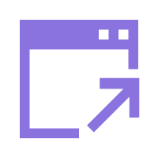 文件关联</a>：绑定 .czemidi / .UIclass / .CzeData 的打开方式

---

<h2 style="font-size: 32px; font-weight: bold; display: flex; align-items: center; gap: 20px; margin-bottom: 16px;">
   
  开始您的创作之旅
</h2>

现在就打开Itoc编辑器，开始制作属于您的第一个crazy error程序吧！
好的，把“作者”和“工作室”并排居中显示。以下是修改后的片段：

从简单的节奏匹配开始，逐渐尝试更复杂的效果组合，您会发现创造有趣的Windows交互体验原来如此简单喵~

如果你对模类感兴趣，可以打开模类设计器，搭一个属于自己的自定义窗口；如果你对插件感兴趣，可以看看插件开发指南，写一个自己的小工具；如果你想让作品支持更多语言，可以做一份语言包分享给大家

如果有任何问题，记得查阅 <a href="help/help.html" style="text-decoration: none; color: #AB92F5; font-weight: bold; font-size: 17px;"> 帮助文档</a> 的其他章节，或者访问我们的支持页面哦~ 

---

  <table style="border: none; border-collapse: collapse; margin: 0 auto;">
    <tr>
      <td style="border: none; padding: 0 40px; text-align: center; vertical-align: top;">
        
         
        <a href="https://space.bilibili.com/3461569935575626" target="_blank" style="text-decoration: none; color: inherit;">
          <strong>小小电子xxdz</strong>
        </a>
         
        XXDZ工作室的室长
      </td>
      <td style="border: none; padding: 0 40px; text-align: center; vertical-align: top;">
        
         
        <a href="https://xxdz-official.github.io/x/XXDZ_Studio.html" target="_blank" style="text-decoration: none; color: inherit;">
          <strong>XXDZ工作室</strong>
        </a>
         
        创新是创造的基石
      </td>
    </tr>
  </table>

 

Copyright © 2026 [XXDZ工作室](https://xxdz-official.github.io/x/XXDZ_Studio.html). All Rights Reserved.

**工作室座右铭 · 创新是创造的基石**

*本程序由小小电子xxdz个人与deepseek辅助开发*
